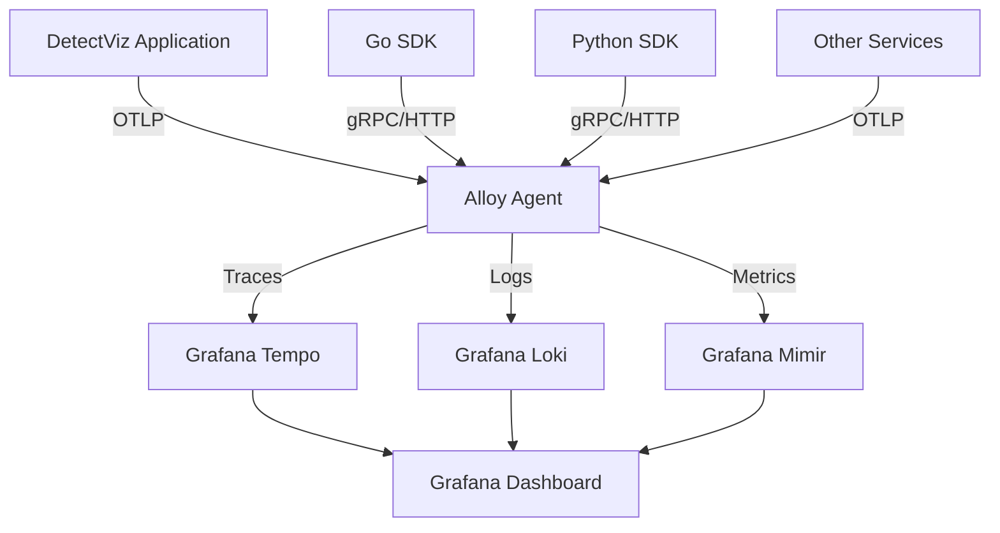

# DetectViz 組合式架構介紹

## 架構特性分析

DetectViz 採用 **組合式架構 (Composable Architecture)** 設計，具備以下特點：
1. **Clean Architecture 分層**：明確的職責分離和依賴方向
2. **Plugin-First 設計**：核心功能通過插件系統擴展
3. **Platform-as-Code**：架構本身作為平台，支援快速組裝
4. **模組化組合**：不同應用可選擇性組合所需模組
5. **框架導向**：DetectViz 本身是框架，可組合成不同的應用平台

## 應避免以下問題

基於組合式架構的需求，目錄結構問題如下：
1. **插件邊界不清**：Plugin 相關目錄分散在不同層級
2. **平台層缺失**：缺乏明確的平台抽象層
3. **組合邏輯混亂**：模組組合和註冊邏輯分散
4. **可組合性差**：難以快速組裝新的應用組合
5. **框架與應用混淆**：未明確區分穩定框架層與可擴展應用層

## 組合式架構重構建議

### 核心設計原則
1. **平台優先**：Platform 層提供核心組合能力
2. **插件驅動**：功能通過 Plugin 系統擴展
3. **組合透明**：模組組合邏輯清晰可見
4. **契約明確**：介面契約統一定義
5. **框架穩定**：核心框架層保持穩定，應用層靈活擴展

## 架構參考策略

### **Platform 抽象：參考 Grafana**
- **Registry 系統**：plugin 載入與管理機制
- **Configuration Schema**：配置驗證與模式定義
- **Plugin Metadata**：插件元資料管理與版本控制

### **Plugin 系統：完全對齊 Telegraf**
- **Input/Output 分離**：`importers/` 與 `exporters/` 完全分開實作
- **單一責任原則**：每個 plugin 僅負責讀取或寫入，不混合功能
- **Interface 驅動**：實作 `Importer`、`Exporter` 等標準介面
- **註冊機制**：採用 `Add(name, factory)` 模式進行 plugin 註冊

### 重構後目錄結構

```bash
detectviz/
├── apps/                        # 應用組合層【框架穩定層】
│   ├── server/                  # 對外 HTTP/gRPC 提供服務
│   ├── cli/                     # 指令列管理工具  
│   ├── agent/                   # 分散式收集與資料推送
│   └── testkit/                 # 測試模組與組合正確性
│
├── compositions/                # 平台組合方案【隨組合擴展】
│   ├── dev-platform/            # DetectViz 開發預設平台組合
│   │   ├── composition.yaml     # 主要組合配置文件
│   │   ├── meta.yaml           # 組合元資料和描述
│   │   └── README.md           # 使用說明文件
│   └── alloy-devkit/            # Alloy 可觀測性開發套件
│       ├── alloy-config.river   # Alloy 配置範本
│       ├── systemd/             # 系統服務配置
│       │   └── alloy.service
│       ├── examples/            # SDK 整合範例
│       │   ├── go/              # Go OTLP 整合範例
│       │   │   ├── main.go
│       │   │   └── go.mod
│       │   └── python/          # Python OTLP 整合範例
│       │       ├── main.py
│       │       └── requirements.txt
│       └── grafana/             # Grafana 儀表板配置
│           ├── tempo.yaml       # Tempo 配置
│           ├── loki.yaml        # Loki 配置
│           └── mimir.yaml       # Mimir 配置
│
├── pkg/                     # 公共契約與平台介面
│   ├── platform/            # 平台核心抽象【框架穩定層】
│   │   ├── contracts/       # 跨模組契約定義【隨組合擴展】
│   │   │   ├── alerting/
│   │   │   ├── monitoring/
│   │   │   ├── notification/
│   │   │   ├── storage/
│   │   │   ├── analytics/   # 分析相關契約
│   │   │   ├── observability/ # 可觀測性契約
│   │   │   │   ├── traces.go    # 追蹤資料契約
│   │   │   │   ├── logs.go      # 日誌資料契約
│   │   │   │   ├── metrics.go   # 指標資料契約
│   │   │   │   ├── alloy.go     # Alloy 配置契約
│   │   │   │   └── grafana.go   # Grafana 整合契約
│   │   │   ├── security/    # 安全相關契約
│   │   │   ├── lifecycle/   # 插件生命週期
│   │   │   ├── importers/   # 匯入器契約
│   │   │   └── exporters/   # 匯出器契約
│   │   ├── registry/        # 註冊機制抽象【框架穩定層】
│   │   │   ├── interface.go
│   │   │   ├── discovery.go
│   │   │   └── composer.go  # 組合邏輯
│   │   └── composition/     # 組合模式定義【框架穩定層】
│   │       ├── app.go       # 應用組合介面
│   │       ├── module.go    # 模組組合介面
│   │       ├── plugin.go    # 插件組合介面
│   │       └── metadata.go  # 插件元資料定義
│   │
│   ├── domain/              # 領域模型(業務實體)【隨組合擴展】
│   │   ├── alert/
│   │   ├── metric/
│   │   ├── rule/
│   │   ├── notification/
│   │   ├── user/            # 使用者領域
│   │   ├── organization/    # 組織領域
│   │   └── security/        # 安全領域
│   │
│   ├── config/              # 統一配置管理
│   │   ├── types/           # 配置結構定義【隨組合擴展】
│   │   ├── schema/          # 配置模式驗證【框架穩定層】
│   │   ├── composition/     # 組合配置【框架穩定層】
│   │   └── loader/          # 配置載入器【框架穩定層】
│   │
│   └── shared/              # 共用工具與常數【框架穩定層】
│       ├── errors/
│       ├── utils/
│       ├── constants/
│       ├── types/           # 基礎類型定義
│       └── security/        # 安全功能共用實作
│           ├── encryption.go # AES, RSA, Hash 相關邏輯
│           ├── token.go     # JWT, SessionToken 產生/驗證
│           ├── secrets.go   # KMS/SecretsManager 介面
│           ├── rbac.go      # 角色權限控制
│           └── audit.go     # 安全審計日誌
│
├── internal/                # 實作層(Clean Architecture 分層)
│   ├── ports/               # 輸入輸出埠【框架穩定層】
│   │   ├── http/            # HTTP API 埠
│   │   │   ├── handlers/    # API 處理器
│   │   │   ├── middleware/  # HTTP 中介層
│   │   │   └── routes/      # 路由定義
│   │   ├── grpc/            # gRPC 埠
│   │   ├── cli/             # CLI 埠
│   │   └── web/             # Web UI 埠 (HTMX + Echo)
│   │       ├── render/      # 模板渲染引擎
│   │       │   ├── renderer.go # Echo template 引擎整合
│   │       │   └── layout.go   # Layout 與 partial 組合邏輯
│   │       ├── context.go   # WebContext 擴充(注入 UserInfo)
│   │       ├── binding.go   # HTML 表單綁定與驗證
│   │       ├── response.go  # RenderPage/RenderPartial 回應格式
│   │       ├── router.go    # Web 路由註冊
│   │       ├── navtree/     # 權限導覽樹生成
│   │       │   └── navtree.go
│   │       ├── pages/       # 頁面模板
│   │       │   ├── alert_status.html
│   │       │   └── dashboard_config.html
│   │       ├── partials/    # 可複用 UI 組件
│   │       │   ├── sidebar.html
│   │       │   ├── table.html
│   │       │   └── topbar.html
│   │       └── static/      # 前端資源
│   │           ├── htmx.min.js
│   │           ├── tabulator.min.js
│   │           └── style.css
│   │
│   ├── services/            # 服務層(業務邏輯)【隨組合擴展】
│   │   ├── alerting/        # 告警服務
│   │   ├── monitoring/      # 監控服務
│   │   ├── notification/    # 通知服務
│   │   ├── reporting/       # 報告服務
│   │   ├── analytics/       # 分析服務
│   │   ├── observability/   # 可觀測性服務層
│   │   │   ├── alloy_manager.go    # Alloy 代理管理
│   │   │   ├── config_generator.go # 配置生成服務
│   │   │   ├── trace_processor.go  # 追蹤處理服務
│   │   │   ├── log_processor.go    # 日誌處理服務
│   │   │   ├── metric_processor.go # 指標處理服務
│   │   │   └── grafana_sync.go     # Grafana 同步服務
│   │   ├── security/        # 安全服務層
│   │   │   ├── authenticator.go # 認證服務
│   │   │   ├── authorizer.go    # 授權服務
│   │   │   ├── token_service.go # Token 管理服務
│   │   │   └── audit_service.go # 審計服務
│   │   ├── user/            # 使用者服務
│   │   └── composition/     # 組合服務
│   │
│   ├── adapters/            # 適配器層(外部系統介接)【隨組合擴展】
│   │   ├── importers/       # 資料匯入適配器(平台資料存取)
│   │   │   ├── users/       # 使用者資料匯入
│   │   │   ├── organizations/ # 組織資料匯入
│   │   │   ├── configs/     # 配置資料匯入
│   │   │   └── policies/    # 政策資料匯入
│   │   ├── exporters/       # 資料匯出適配器(監控輸出)
│   │   │   ├── logs/        # 日誌匯出
│   │   │   ├── traces/      # 追蹤匯出
│   │   │   ├── metrics/     # 指標匯出
│   │   │   └── events/      # 事件匯出
│   │   └── integrations/    # 第三方整合適配器
│   │       ├── prometheus/  # Prometheus 整合
│   │       ├── influxdb/    # InfluxDB 整合
│   │       ├── email/       # 郵件整合
│   │       ├── slack/       # Slack 整合
│   │       ├── webhook/     # Webhook 整合
│   │       └── ldap/        # LDAP 整合
│   │
│   ├── platform/            # 平台實作層【框架穩定層】
│   │   ├── registry/        # 註冊機制實作
│   │   │   ├── manager.go   # 註冊管理器
│   │   │   ├── discovery.go # 自動發現
│   │   │   ├── resolver.go  # 依賴解析
│   │   │   └── auth.go      # 認證插件註冊
│   │   ├── composition/     # 組合引擎實作
│   │   │   ├── builder.go   # 組合建構器
│   │   │   ├── lifecycle.go # 生命週期管理(核心實作)
│   │   │   ├── injector.go  # 依賴注入
│   │   │   └── validator.go # 組合驗證器
│   │   ├── observability/   # 可觀測性平台實作
│   │   │   ├── pipeline.go  # 資料處理管道
│   │   │   ├── collector.go # 資料收集器
│   │   │   ├── exporter.go  # 資料匯出器
│   │   │   └── instrumentation.go # 自動儀表化
│   │   └── runtime/         # 運行時管理
│   │       ├── bootstrap.go
│   │       ├── shutdown.go
│   │       └── health.go
│   │
│   ├── repositories/        # 資料存取層【隨組合擴展】
│   │   ├── alert/
│   │   ├── rule/
│   │   ├── metric/
│   │   ├── user/
│   │   ├── organization/    # 組織資料存取
│   │   ├── policy/          # 政策資料存取
│   │   └── plugin/          # 插件元資料儲存
│   │
│   └── infrastructure/      # 基礎設施層【框架穩定層】
│       ├── eventbus/        # 事件匯流排(介面層)
│       ├── cache/           # 快取系統(介面層 + memory fallback)
│       │   ├── interface.go # CacheClient interface
│       │   ├── memory.go    # 預設 fallback 實作
│       │   └── context.go   # Context wrapper
│       ├── metrics/         # 指標收集
│       ├── logging/         # 日誌系統
│       └── tracing/         # 追蹤系統
│    
└── plugins/                 # 插件生態系統
    ├── core/                # 核心插件(內建)【框架穩定層】
    │   ├── auth/            # 認證插件
    │   │   ├── basic/       # 基本認證
    │   │   ├── jwt/         # JWT 認證
    │   │   └── session/     # Session 認證
    │   ├── middleware/      # 中介層插件
    │   │   ├── cors/        # 跨域處理
    │   │   ├── ratelimit/   # 限速控制
    │   │   ├── logging/     # 請求日誌
    │   │   ├── recovery/    # 錯誤恢復
    │   │   └── metrics/     # HTTP 指標記錄
    │   └── hooks/           # 平台級事件 hook 系統
    │
    └── community/           # 社群插件【隨組合擴展】
        ├── importers/       # 資料匯入插件(Telegraf Input 模式)
        │   ├── prometheus/  # 從 Prometheus 抓取 metrics
        │   ├── influxdb/    # 從 InfluxDB 查詢時序資料
        │   ├── loki/        # 從 Loki 查詢日誌
        │   ├── mysql/       # 從 MySQL 匯入資料
        │   ├── sqlite/      # 從 SQLite 匯入資料
        │   ├── redis/       # 從 Redis 載入快取資料
        │   ├── csv/         # 匯入 CSV 檔案
        │   ├── json/        # 匯入 JSON 資料
        │   └── api/         # 透過 API 匯入資料
        │
        ├── exporters/       # 資料匯出插件(Telegraf Output 模式)
        │   ├── prometheus/  # 暴露 /metrics 給 Prometheus
        │   ├── influxdb/    # 寫入資料到 InfluxDB
        │   ├── loki/        # 推送日誌到 Loki
        │   ├── mysql/       # 寫入資料到 MySQL
        │   ├── sqlite/      # 寫入資料到 SQLite
        │   ├── redis/       # 推送資料到 Redis
        │   ├── csv/         # 匯出為 CSV 檔案
        │   ├── json/        # 匯出為 JSON 格式
        │   └── api/         # 透過 API 推送資料
        │
        ├── integrations/    # 第三方整合插件
        │   ├── observability/ # 可觀測性整合
        │   │   ├── alloy/   # Grafana Alloy 整合
        │   │   │   ├── config-generator/ # Alloy 配置生成器
        │   │   │   ├── otlp-receiver/    # OTLP 接收器
        │   │   │   ├── tempo-exporter/   # Tempo 匯出器
        │   │   │   ├── loki-exporter/    # Loki 匯出器
        │   │   │   └── mimir-exporter/   # Mimir 匯出器
        │   │   ├── grafana/ # Grafana 整合
        │   │   │   ├── dashboard-sync/   # 儀表板同步
        │   │   │   ├── datasource-mgmt/  # 資料源管理
        │   │   │   └── alert-rules/      # 告警規則同步
        │   │   └── opentelemetry/ # OpenTelemetry 整合
        │   │       ├── sdk-wrapper/      # SDK 包裝器
        │   │       ├── auto-instrument/  # 自動儀表化
        │   │       └── collector-bridge/ # Collector 橋接
        │   ├── notification/ # 通知整合
        │   │   ├── email/   # 郵件通知
        │   │   ├── slack/   # Slack 通知
        │   │   └── webhook/ # Webhook 通知
        │   ├── security/    # 安全整合
        │   │   ├── keycloak/ # Keycloak IdP 整合
        │   │   ├── ldap/    # LDAP 整合
        │   │   ├── oauth/   # OAuth2 通用實作
        │   │   ├── saml/    # SAML SSO 整合
        │   │   ├── radius/  # RADIUS 認證
        │   │   ├── team/    # 團隊管理(可選)
        │   │   └── ssosettings/ # SSO 設定管理
        │   ├── middleware/  # 可選中介層
        │   │   ├── tracing/ # OpenTelemetry 追蹤
        │   │   ├── csrf/    # CSRF 保護
        │   │   └── gzip/    # 回應壓縮
        │   ├── cache/       # 快取實作插件
        │   │   └── redis/   # Redis 快取實作
        │   ├── system/      # 系統整合
        │   │   ├── datasourceproxy/ # 資料源代理
        │   │   ├── quota/   # 資源配額管理
        │   │   ├── search/  # 統一查詢服務
        │   │   └── live/    # 即時推播橋接
        │   └── processors/  # 資料處理器整合
        │       ├── alert-processor/ # 告警處理器
        │       │   ├── deduplicator.go # 去重邏輯
        │       │   ├── enricher.go     # 資料豐富化
        │       │   └── aggregator.go   # 聚合處理
        │       ├── metric-processor/   # 指標處理器
        │       └── log-processor/      # 日誌處理器
        │
        ├── tools/           # 工具插件
        │   ├── generators/  # 產生器工具
        │   ├── validators/  # 驗證工具
        │   ├── converters/  # 轉換工具
        │   ├── supportbundles/ # 問題診斷工具
        │   └── middleware/  # 開發用中介層
        │       ├── cookies/ # Cookie 管理輔助
        │       ├── requestmeta/ # Request metadata 處理
        │       └── inject-debug-id/ # Debug ID 注入
        │
        ├── visualizers/     # 視覺化整合
        │   ├── trace-visualizer/   # 追蹤視覺化
        │   ├── topology-visualizer/ # 拓撲視覺化
        │   └── dashboard-builder/  # 儀表板建構器
        │
        └── web/             # Web UI 擴展插件
            ├── themes/      # 主題與樣式擴展
            │   ├── dark-theme/     # 深色主題
            │   ├── light-theme/    # 淺色主題
            │   └── custom-theme/   # 自訂主題
            ├── components/  # UI 組件擴展
            │   ├── charts/         # 圖表組件
            │   ├── forms/          # 表單組件
            │   ├── tables/         # 表格組件
            │   └── widgets/        # 小工具組件
            ├── pages/       # 頁面擴展
            │   ├── custom-dashboard/ # 自訂儀表板
            │   ├── plugin-config/    # 插件配置頁面
            │   └── system-status/    # 系統狀態頁面
            └── navtree/     # 導覽樹擴展
                ├── admin-nav/      # 管理員導覽
                ├── user-nav/       # 使用者導覽
                └── plugin-nav/     # 插件導覽

```

## 框架穩定性分析

### **框架穩定層(Core Framework)**
這些目錄隨著 DetectViz 框架成熟會趨向穩定：

```bash
# 應用組合框架
apps/                        # 應用類型穩定(server, cli, agent, testkit)

# 平台核心框架  
pkg/platform/registry/       # 註冊機制抽象
pkg/platform/composition/    # 組合模式定義
pkg/config/schema/           # 配置模式驗證
pkg/config/composition/      # 組合配置
pkg/config/loader/           # 配置載入器
pkg/shared/                  # 共用工具

# 平台實作框架
internal/platform/           # 平台實作層
internal/infrastructure/     # 基礎設施層
internal/ports/              # 輸入輸出埠

# 核心插件框架
plugins/core/                # 內建核心插件

# 範例與教學
examples/                    # 範例與教學
```

### **應用擴展層(Application Extensions)**
這些目錄會隨著組合方案增加而持續擴充：

```bash
# 契約與領域擴展
pkg/platform/contracts/      # 新的領域契約
pkg/domain/                  # 新的領域模型
pkg/config/types/            # 新的配置類型

# 服務與適配器擴展
internal/services/           # 新的業務服務
internal/adapters/           # 新的適配器實作
internal/repositories/       # 新的資料存取

# 社群插件擴展
plugins/community/           # 社群貢獻插件
plugins/custom/              # 自訂插件

# 組合方案擴展
compositions/                # 新的組合定義

## 組合平台 (Compositions)

DetectViz 採用組合式架構，透過 `compositions/` 目錄定義不同的平台組合方案。每個組合代表一個完整的應用配置，包含特定的插件、配置和元資料。

### 組合平台結構

每個組合平台目錄包含：

```bash
compositions/{name}/
├── composition.yaml    # 主要組合配置文件
├── meta.yaml          # 組合元資料和描述
└── README.md          # 使用說明文件
```

### 預設組合：dev-platform

`dev-platform` 是 DetectViz 的預設開發組合，適用於：
- 本地開發和測試
- 插件驗證和整合
- 框架功能學習

**核心特色：**
- JWT 認證系統 (`core-auth-jwt`)
- OtelZap 結構化日誌 (`otelzap-logger`)
- 記憶體式基礎設施
- 自動插件註冊與健康檢查
- 開發友好的預設配置

### 使用組合平台

啟動特定組合：
```bash
go run apps/server/main.go --composition=dev-platform
```

組合配置結構：
```yaml
# composition.yaml
metadata:
  name: dev-platform
  description: DetectViz 預設開發平台組合
  version: 1.0.0

spec:
  core_plugins:
    - name: core-auth-jwt
      type: auth
      enabled: true
      config:
        secret: dev-secret
  
  health:
    plugins:
      include: all  # 包含所有插件的健康檢查
```

### 健康檢查配置

組合平台支援靈活的健康檢查配置：

```yaml
health:
  enabled: true
  interval: "30s"
  timeout: "5s"
  plugins:
    include: all  # 或指定特定插件列表
    # include: [core-auth-jwt, otelzap-logger]
```
```

## 核心架構決策與實作策略

### **1. Lifecycle 管理策略**
基於討論決定，生命週期管理是平台核心職責：

```bash
internal/platform/composition/
├── builder.go       # 組合建構器
├── lifecycle.go     # 生命週期管理(核心實作)
├── injector.go      # 依賴注入
└── validator.go     # 組合驗證器
```

**生命週期介面設計：**
```go
// 平台級生命週期管理
type LifecycleManager interface {
    Initialize(ctx context.Context) error
    Start(ctx context.Context) error
    Stop(ctx context.Context) error
    Shutdown(ctx context.Context) error
}

// 插件生命週期感知介面
type LifecycleAware interface {
    OnRegister() error
    OnStart() error
    OnStop() error
    OnShutdown() error
}
```

### **2. Security 實作層級策略**
Security 功能實作於共用層，由上層服務注入：

```bash
pkg/shared/security/         # 安全功能共用實作
├── encryption.go           # AES, RSA, Hash 相關邏輯
├── token.go               # JWT, SessionToken 產生/驗證
├── secrets.go             # KMS/SecretsManager 介面
├── rbac.go                # 角色權限控制
└── audit.go               # 安全審計日誌

internal/services/security/  # 安全服務層
├── authenticator.go        # 認證服務
├── authorizer.go          # 授權服務
├── token_service.go       # Token 管理服務
└── audit_service.go       # 審計服務
```

**安全服務註冊模式：**
```go
// 由 internal/services/security 引用 pkg/shared/security
type SecurityService struct {
    tokenSigner    security.TokenSigner
    passwordHasher security.PasswordHasher
    encryptor      security.Encryptor
}

// 註冊到平台
func (s *SecurityService) Register(registry Registry) error {
    registry.RegisterAuthenticator("jwt", s.NewJWTAuthenticator)
    registry.RegisterAuthorizer("rbac", s.NewRBACAuthorizer)
    return nil
}
```

### **3. System 模組細化策略**
將 system 相關功能細化為可組合的插件：

```bash
# 原本的基礎設施層保留最小介面
internal/infrastructure/     
├── eventbus/               # 保留事件匯流排介面
├── cache/                  # 保留快取介面(含 memory fallback)
└── health/                 # 保留健康檢查介面

# 具體實作移至社群插件
plugins/community/exporters/
├── prometheus/             # Prometheus metrics 匯出
├── loki/                   # Loki logs 匯出  
├── jaeger/                 # Jaeger traces 匯出
└── opentelemetry/          # OpenTelemetry 匯出

plugins/community/integrations/
├── eventbus/
│   ├── nats/               # NATS 事件匯流排
│   ├── kafka/              # Kafka 事件匯流排
│   └── redis/              # Redis 事件匯流排
├── cache/
│   └── redis/              # Redis 快取實作
└── monitoring/
    ├── healthcheck/        # 健康檢查整合
    ├── metrics/            # 指標收集整合
    └── tracing/            # 追蹤整合
```

### **4. Caching 策略說明**
基於討論決定，快取採用混合策略：

**保留基礎設施介面層：**
```bash
internal/infrastructure/cache/
├── interface.go        # CacheClient interface 定義
├── memory.go           # 預設 memory 實作(fallback)
└── context.go          # Context wrapper
```

**Plugin 實作層：**
```bash
plugins/community/
├── importers/redis/        # 載入快取種子資料
├── exporters/redis/        # 輸出計算結果到 Redis
└── integrations/cache/redis/ # Redis 快取實作注入
```

### **5. Processor 與 Visualizer 擴展策略**
基於現有 integrations 進行功能疊加：

```bash
plugins/community/integrations/
├── processors/             # 資料處理器整合
│   ├── alert-processor/    # 告警處理器
│   │   ├── deduplicator.go # 去重邏輯
│   │   ├── enricher.go     # 資料豐富化
│   │   └── aggregator.go   # 聚合處理
│   ├── metric-processor/   # 指標處理器
│   └── log-processor/      # 日誌處理器
└── visualizers/            # 視覺化整合
    ├── trace-visualizer/   # 追蹤視覺化
    ├── topology-visualizer/ # 拓撲視覺化
    └── dashboard-builder/  # 儀表板建構器
```

**可插拔配置範例：**
```yaml
composition:
  name: "enhanced-monitoring"
  plugins:
    # 基礎監控
    - community/exporters/prometheus
    - community/integrations/notification/slack
    
    # 可選的處理器(enabled 控制)
    - community/integrations/processors/alert-processor:
        enabled: true
        config:
          deduplication: true
          enrichment: true
    
    # 可選的視覺化(enabled 控制)
    - community/integrations/visualizers/trace-visualizer:
        enabled: false  # 可關閉以保持輕量
```

## 核心插件最終設計

基於討論，`plugins/core/` 保持精簡：

```bash
plugins/core/                # 核心插件(框架穩定層)
├── auth/                   # 認證策略
│   ├── basic/              # 基本認證
│   ├── jwt/                # JWT 認證
│   └── session/            # Session 認證
├── middleware/             # HTTP 中介層
│   ├── cors/               # 跨域處理
│   ├── ratelimit/          # 限速控制
│   ├── logging/            # 請求日誌
│   ├── recovery/           # 錯誤恢復
│   └── metrics/            # HTTP 指標記錄
└── hooks/                  # 平台級事件 hook 系統
```

**不新增的核心插件：**
- ❌ `core/lifecycle/` → 由 `internal/platform/composition/lifecycle.go` 處理
- ❌ `core/security/` → 由 `pkg/shared/security/` + `internal/services/security/` 處理  
- ❌ `core/system/` → 細化為 `plugins/community/` 的各種整合插件

## Plugin 設計規範

### **Plugin Interface 標準**
```go
// 基礎 Plugin 介面
type Plugin interface {
    Name() string
    Version() string
    Description() string
    Init(config any) error
    Shutdown() error
}

// 匯入器介面 (Telegraf Input 模式)
type Importer interface {
    Plugin
    Import(ctx context.Context) error
}

// 匯出器介面 (Telegraf Output 模式)  
type Exporter interface {
    Plugin
    Export(ctx context.Context, data any) error
}

// Web UI 擴展介面
type WebUIPlugin interface {
    Plugin
    RegisterRoutes(router WebRouter) error
    RegisterNavNodes(navtree NavTreeBuilder) error
    RegisterComponents(registry ComponentRegistry) error
}

// 生命週期感知介面
type LifecycleAware interface {
    OnRegister() error
    OnStart() error
    OnStop() error
    OnShutdown() error
}
```

### **Plugin 註冊模式**
```go
// 每個 plugin 目錄下的 plugin.go
func Register(reg contracts.Registry) {
    reg.RegisterImporter("prometheus", NewPrometheusImporter)
    reg.RegisterExporter("prometheus", NewPrometheusExporter)
}

// Plugin 工廠函式
func NewPrometheusImporter(config any) (contracts.Importer, error) {
    return &PrometheusImporter{config: config}, nil
}
```

### **Plugin 元資料定義**
```go
// pkg/platform/composition/metadata.go
type PluginMetadata struct {
    Name        string            `yaml:"name"`
    Version     string            `yaml:"version"`
    Type        string            `yaml:"type"` // importer, exporter, integration, tool
    Category    string            `yaml:"category"` // core, community, custom
    Description string            `yaml:"description"`
    Author      string            `yaml:"author"`
    License     string            `yaml:"license"`
    Dependencies []string         `yaml:"dependencies"`
    Config      map[string]any    `yaml:"config"`
    Enabled     bool              `yaml:"enabled"`
}
```

## 依賴管理與設計約束

### **依賴方向規則**
為避免循環依賴，嚴格遵循以下依賴方向：

```bash
# 允許的依賴方向 (A → B 表示 A 可以依賴 B)
plugins/ → pkg/platform/contracts/     # Plugin 實作契約介面
plugins/ → pkg/shared/                 # Plugin 使用共用工具
internal/ → pkg/                       # 內部實作依賴公共介面
apps/ → internal/                      # 應用層依賴內部實作
apps/ → pkg/                          # 應用層依賴公共介面

# 禁止的依賴方向
pkg/ ❌→ internal/                     # 公共介面不可依賴內部實作
pkg/ ❌→ plugins/                      # 公共介面不可依賴具體插件
internal/platform/ ❌→ plugins/        # 平台核心不可依賴具體插件
```

### **分層約束規則**

| 層級 | 可依賴層級 | 禁止依賴 | 說明 |
|------|------------|----------|------|
| `apps/` | `internal/`, `pkg/` | `plugins/` 直接依賴 | 透過 registry 動態載入 plugin |
| `internal/services/` | `pkg/domain/`, `pkg/shared/`, `internal/repositories/` | `plugins/`, `internal/ports/` | 服務層不依賴外部埠或具體插件 |
| `internal/adapters/` | `pkg/platform/contracts/`, `pkg/shared/` | `internal/services/` | 適配器不依賴業務邏輯 |
| `internal/platform/` | `pkg/platform/`, `pkg/shared/` | `internal/services/`, `plugins/` | 平台核心保持獨立 |
| `plugins/` | `pkg/platform/contracts/`, `pkg/shared/` | `internal/`, 其他 `plugins/` | Plugin 間不可相互依賴 |
| `pkg/platform/contracts/` | `pkg/shared/types/` | 所有其他模組 | 契約層保持純淨 |

### **Plugin 隔離約束**
```go
// ✅ 正確：Plugin 透過契約介面互動
type PrometheusExporter struct {
    registry contracts.Registry  // 透過 registry 取得其他服務
    logger   shared.Logger       // 使用共用工具
}

// ❌ 錯誤：Plugin 直接依賴其他 Plugin
type PrometheusExporter struct {
    influxImporter *influxdb.Importer  // 不可直接依賴其他 plugin
}

// ✅ 正確：透過事件或 registry 間接互動
func (p *PrometheusExporter) Export(data any) error {
    // 透過事件匯流排通知其他 plugin
    p.eventBus.Publish("data.exported", data)
    return nil
}
```

### **Configuration 依賴管理**
```yaml
# compositions/monitoring-stack.yaml
composition:
  name: "monitoring-stack"
  dependencies:  # 明確聲明依賴關係
    - pkg/platform/contracts/exporters
    - pkg/shared/security
  plugins:
    - community/exporters/prometheus:
        depends_on: []  # 無依賴
    - community/integrations/notification/slack:
        depends_on: ["prometheus"]  # 依賴 prometheus 先啟動
```

### **Runtime 依賴解析**
```go
// internal/platform/composition/resolver.go
type DependencyResolver struct {
    registry contracts.Registry
    graph    *DependencyGraph
}

func (r *DependencyResolver) ResolveDependencies(plugins []PluginConfig) ([]Plugin, error) {
    // 1. 建立依賴圖
    // 2. 檢測循環依賴
    // 3. 拓撲排序
    // 4. 按順序初始化 plugin
}
```

## 架構演進路徑

### **階段一：核心穩定化**
1. 完善 `internal/platform/composition/lifecycle.go`
2. 建立 `pkg/shared/security/` 共用安全功能
3. 保持 `plugins/core/` 精簡設計
4. **建立 Web UI 基礎架構**：完成 `internal/web/` 核心組件
5. **Alloy 基礎整合**：建立 `compositions/alloy-devkit/` 配置範本

### **階段二：系統插件化**
1. 將 `internal/infrastructure/` 具體實作移至 `plugins/community/`
2. 保留最小介面在基礎設施層
3. 建立可組合的監控堆疊
4. **Web UI Plugin 機制**：實作 `WebUIPlugin` 介面與註冊機制
5. **Alloy Plugin 生態**：完成 `plugins/community/integrations/observability/` 插件

### **階段三：功能擴展**
1. 基於現有 integrations 疊加 processor 功能
2. 開發可選的 visualizer 插件
3. 完善 enabled/disabled 控制機制
4. **Web UI 組件生態**：建立標準 UI 組件庫與主題系統
5. **可觀測性自動化**：實作 `internal/services/observability/` 自動配置與部署

### **階段四：生態完善**
1. 建立 plugin 開發工具鏈
2. 完善 plugin 測試與驗證機制
3. 建立 plugin 市場與分發機制
4. **Web UI 開發者體驗**：提供 UI Plugin 開發工具與文檔
5. **可觀測性 DevKit**：提供完整的 SDK、範例與最佳實踐指南

---

這個調整後的架構更好地反映了討論中的核心決策，保持了框架的穩定性同時提供了充分的擴展彈性。特別是：

1. **明確了 Telegraf vs Grafana 的參考策略**
2. **完善了 Plugin 系統的設計規範**
3. **補充了具體的實作策略和程式碼範例**
4. **加入了 Plugin 元資料和生命週期管理**
5. **提供了清晰的架構演進路徑**

---

## Alloy 可觀測性開發套件

### **Config-Driven 監控導入**

DetectViz 整合 **Grafana Alloy** 作為統一的可觀測性代理，提供完整的 Traces、Logs、Metrics 收集與轉發能力：

**核心特性：**
- **配置驅動**：透過 `alloy-config.river` 統一管理監控配置
- **OTLP 原生支援**：完整支援 OpenTelemetry Protocol
- **多語言 SDK**：提供 Go、Python 等語言的整合範例
- **Grafana 生態整合**：無縫對接 Tempo、Loki、Mimir
- **系統服務化**：支援 systemd 等系統服務管理

### **監控架構流程**



### **Alloy 配置管理**

```go
// pkg/platform/contracts/observability.go
type ObservabilityConfig interface {
    GenerateAlloyConfig() ([]byte, error)
    ValidateConfig() error
    GetEndpoints() map[string]string
    SetCredentials(creds map[string]string) error
}

type AlloyConfigGenerator struct {
    services    []ServiceConfig
    exporters   []ExporterConfig
    receivers   []ReceiverConfig
    processors  []ProcessorConfig
}

func (acg *AlloyConfigGenerator) GenerateAlloyConfig() ([]byte, error) {
    config := AlloyConfig{
        Server: ServerConfig{
            LogLevel:       "info",
            HTTPListenPort: 12345,
        },
        OTEL: OTELConfig{
            Protocols: map[string]interface{}{
                "http": nil,
                "grpc": nil,
            },
        },
        Prometheus: PrometheusConfig{
            WALDirectory: "/tmp/wal",
            Global: GlobalConfig{
                ScrapeInterval: "15s",
            },
            ScrapeConfigs: acg.generateScrapeConfigs(),
        },
        Loki: LokiConfig{
            Clients: acg.generateLokiClients(),
        },
        Tempo: TempoConfig{
            Receivers: acg.generateTempoReceivers(),
            RemoteWrite: acg.generateTempoRemoteWrite(),
        },
    }
    
    return yaml.Marshal(config)
}
```

### **SDK 整合範例**

**Go SDK 整合：**
```go
// plugins/community/integrations/observability/opentelemetry/sdk-wrapper/go_tracer.go
package otel

import (
    "context"
    "go.opentelemetry.io/otel"
    "go.opentelemetry.io/otel/exporters/otlp/otlptrace/otlptracegrpc"
    sdktrace "go.opentelemetry.io/otel/sdk/trace"
)

type DetectVizTracer struct {
    tracer trace.Tracer
    tp     *sdktrace.TracerProvider
}

func NewDetectVizTracer(serviceName string, alloyEndpoint string) (*DetectVizTracer, error) {
    ctx := context.Background()
    
    // 建立 OTLP gRPC exporter 指向 Alloy
    exporter, err := otlptracegrpc.New(ctx, 
        otlptracegrpc.WithEndpoint(alloyEndpoint),
        otlptracegrpc.WithInsecure(),
    )
    if err != nil {
        return nil, err
    }
    
    // 建立 TracerProvider
    tp := sdktrace.NewTracerProvider(
        sdktrace.WithBatcher(exporter),
        sdktrace.WithResource(resource.NewWithAttributes(
            semconv.SchemaURL,
            semconv.ServiceNameKey.String(serviceName),
        )),
    )
    
    otel.SetTracerProvider(tp)
    tracer := otel.Tracer("detectviz")
    
    return &DetectVizTracer{
        tracer: tracer,
        tp:     tp,
    }, nil
}

func (dt *DetectVizTracer) StartSpan(ctx context.Context, operationName string) (context.Context, trace.Span) {
    return dt.tracer.Start(ctx, operationName)
}
```

**Python SDK 整合：**
```python
# plugins/community/integrations/observability/opentelemetry/sdk-wrapper/python_tracer.py
from opentelemetry import trace
from opentelemetry.sdk.trace import TracerProvider
from opentelemetry.exporter.otlp.proto.grpc.trace_exporter import OTLPSpanExporter
from opentelemetry.sdk.trace.export import BatchSpanProcessor

class DetectVizTracer:
    def __init__(self, service_name: str, alloy_endpoint: str):
        self.service_name = service_name
        self.alloy_endpoint = alloy_endpoint
        self._setup_tracer()
    
    def _setup_tracer(self):
        trace.set_tracer_provider(TracerProvider())
        span_processor = BatchSpanProcessor(
            OTLPSpanExporter(
                endpoint=self.alloy_endpoint, 
                insecure=True
            )
        )
        trace.get_tracer_provider().add_span_processor(span_processor)
        self.tracer = trace.get_tracer(self.service_name)
    
    def start_span(self, operation_name: str):
        return self.tracer.start_as_current_span(operation_name)
```

### **自動化部署與配置**

```go
// internal/services/observability/alloy_manager.go
type AlloyManager struct {
    configPath    string
    servicePath   string
    binaryPath    string
    systemdClient SystemdClient
}

func (am *AlloyManager) Deploy(config AlloyConfig) error {
    // 1. 生成配置檔案
    configBytes, err := yaml.Marshal(config)
    if err != nil {
        return err
    }
    
    if err := os.WriteFile(am.configPath, configBytes, 0644); err != nil {
        return err
    }
    
    // 2. 建立 systemd 服務
    serviceContent := am.generateSystemdService()
    if err := os.WriteFile(am.servicePath, []byte(serviceContent), 0644); err != nil {
        return err
    }
    
    // 3. 啟用並啟動服務
    if err := am.systemdClient.DaemonReload(); err != nil {
        return err
    }
    
    if err := am.systemdClient.Enable("alloy.service"); err != nil {
        return err
    }
    
    return am.systemdClient.Start("alloy.service")
}

func (am *AlloyManager) generateSystemdService() string {
    return fmt.Sprintf(`[Unit]
Description=Grafana Alloy Service for DetectViz
After=network.target

[Service]
Type=simple
ExecStart=%s --config.file=%s
Restart=always
RestartSec=5s
StandardOutput=syslog
StandardError=syslog
SyslogIdentifier=alloy
User=alloy
Group=alloy

[Install]
WantedBy=multi-user.target`, am.binaryPath, am.configPath)
}
```

### **監控資料流管道**

```go
// internal/platform/observability/pipeline.go
type ObservabilityPipeline struct {
    tracesReceiver  TracesReceiver
    logsReceiver    LogsReceiver
    metricsReceiver MetricsReceiver
    alloyExporter   AlloyExporter
}

func (op *ObservabilityPipeline) ProcessTraces(ctx context.Context, traces []Trace) error {
    // 1. 接收應用程式產生的 traces
    for _, trace := range traces {
        // 2. 進行資料處理與豐富化
        enrichedTrace := op.enrichTrace(trace)
        
        // 3. 透過 Alloy 轉發到 Tempo
        if err := op.alloyExporter.ExportTrace(ctx, enrichedTrace); err != nil {
            return err
        }
    }
    return nil
}

func (op *ObservabilityPipeline) ProcessLogs(ctx context.Context, logs []LogEntry) error {
    for _, log := range logs {
        enrichedLog := op.enrichLog(log)
        if err := op.alloyExporter.ExportLog(ctx, enrichedLog); err != nil {
            return err
        }
    }
    return nil
}

func (op *ObservabilityPipeline) ProcessMetrics(ctx context.Context, metrics []Metric) error {
    for _, metric := range metrics {
        enrichedMetric := op.enrichMetric(metric)
        if err := op.alloyExporter.ExportMetric(ctx, enrichedMetric); err != nil {
            return err
        }
    }
    return nil
}
```

## Web UI 架構整合

### **HTMX + Echo 模組化設計**

DetectViz Web UI 採用 **HTMX + Echo** 技術棧，提供現代化的互動式 Web 介面：

**核心特性：**
- **模組化 UI**：支援 plugin 註冊自訂頁面與組件
- **HTMX 部分更新**：無需 JavaScript 框架的動態 UI 更新
- **權限導覽樹**：基於角色的動態導覽選單生成
- **主題系統**：支援多主題切換與自訂樣式
- **組件複用**：標準化 UI 組件庫（表格、圖表、表單等）

### **Web UI Plugin 擴展機制**

```go
// Web UI Plugin 註冊範例
type CustomDashboardPlugin struct {
    name string
}

func (p *CustomDashboardPlugin) RegisterRoutes(router WebRouter) error {
    router.GET("/web/custom/dashboard", p.handleDashboard)
    router.POST("/web/custom/config", p.handleConfig)
    return nil
}

func (p *CustomDashboardPlugin) RegisterNavNodes(navtree NavTreeBuilder) error {
    navtree.AddNode("custom", NavNode{
        Title: "自訂儀表板",
        Icon:  "dashboard",
        URL:   "/web/custom/dashboard",
        Permission: "dashboard.view",
    })
    return nil
}

func (p *CustomDashboardPlugin) RegisterComponents(registry ComponentRegistry) error {
    registry.RegisterPartial("custom-chart", "templates/custom-chart.html")
    registry.RegisterWidget("status-widget", p.statusWidgetHandler)
    return nil
}
```

### **HTMX 互動模式**

```html
<!-- 動態表格更新範例 -->
<div id="alert-table" 
     hx-get="/web/alerts/status" 
     hx-trigger="every 30s"
     hx-target="#alert-table"
     hx-swap="innerHTML">
    <!-- 表格內容由 HTMX 動態載入 -->
</div>

<!-- 表單提交範例 -->
<form hx-post="/web/rule/create" 
      hx-target="#result-panel"
      hx-swap="innerHTML">
    <input name="rule_name" type="text" required>
    <button type="submit">建立規則</button>
</form>
```

### **權限整合與安全性**

```go
// WebContext 權限注入
type WebContext interface {
    echo.Context
    User() *auth.UserInfo
    HasPermission(action, resource string) bool
    RenderPage(name string, data any) error
    RenderPartial(name string, data any) error
}

// 權限中介層
func PermissionMiddleware(requiredPermission string) echo.MiddlewareFunc {
    return func(next echo.HandlerFunc) echo.HandlerFunc {
        return func(c echo.Context) error {
            webCtx := c.(*WebContext)
            if !webCtx.HasPermission("view", requiredPermission) {
                return c.Render(403, "error/forbidden", nil)
            }
            return next(c)
        }
    }
}
```

## Plugin 間通訊與資料流

### **通訊機制設計**

**1. 事件驅動通訊 (推薦)**
```go
// pkg/platform/contracts/eventbus.go
type EventBus interface {
    Publish(topic string, data any) error
    Subscribe(topic string, handler EventHandler) error
    Unsubscribe(topic string, handler EventHandler) error
}

type EventHandler func(event Event) error

type Event struct {
    ID        string                 `json:"id"`
    Topic     string                 `json:"topic"`
    Source    string                 `json:"source"`    // 來源 plugin
    Timestamp time.Time              `json:"timestamp"`
    Data      map[string]interface{} `json:"data"`
    Metadata  map[string]string      `json:"metadata"`
}
```

**2. 資料管道通訊**
```go
// pkg/platform/contracts/pipeline.go
type DataPipeline interface {
    Send(data StandardData) error
    Receive() <-chan StandardData
    Transform(transformer DataTransformer) DataPipeline
}

type StandardData struct {
    Type      string                 `json:"type"`      // metrics, logs, traces, alerts
    Source    string                 `json:"source"`    // 來源 plugin
    Timestamp time.Time              `json:"timestamp"`
    Labels    map[string]string      `json:"labels"`
    Fields    map[string]interface{} `json:"fields"`
    Raw       []byte                 `json:"raw,omitempty"`
}
```

### **資料格式標準化**

**統一資料模型：**
```go
// pkg/shared/types/data.go
type MetricData struct {
    Name      string            `json:"name"`
    Value     float64           `json:"value"`
    Unit      string            `json:"unit"`
    Labels    map[string]string `json:"labels"`
    Timestamp time.Time         `json:"timestamp"`
}

type LogData struct {
    Level     string            `json:"level"`
    Message   string            `json:"message"`
    Source    string            `json:"source"`
    Labels    map[string]string `json:"labels"`
    Timestamp time.Time         `json:"timestamp"`
    Fields    map[string]any    `json:"fields"`
}

type AlertData struct {
    ID          string            `json:"id"`
    Title       string            `json:"title"`
    Description string            `json:"description"`
    Severity    string            `json:"severity"`
    Status      string            `json:"status"`
    Labels      map[string]string `json:"labels"`
    Annotations map[string]string `json:"annotations"`
    StartsAt    time.Time         `json:"starts_at"`
    EndsAt      *time.Time        `json:"ends_at,omitempty"`
}
```

### **Plugin 通訊範例**

**Importer → Exporter 資料流：**
```go
// plugins/community/importers/prometheus/importer.go
func (p *PrometheusImporter) Import(ctx context.Context) error {
    metrics, err := p.scrapeMetrics()
    if err != nil {
        return err
    }
    
    // 透過事件匯流排發送資料
    for _, metric := range metrics {
        event := Event{
            Topic:  "data.metrics.collected",
            Source: "prometheus-importer",
            Data:   map[string]interface{}{"metric": metric},
        }
        p.eventBus.Publish(event.Topic, event)
    }
    return nil
}

// plugins/community/exporters/influxdb/exporter.go
func (e *InfluxDBExporter) OnStart() error {
    // 訂閱 metrics 事件
    return e.eventBus.Subscribe("data.metrics.collected", e.handleMetrics)
}

func (e *InfluxDBExporter) handleMetrics(event Event) error {
    metric := event.Data["metric"].(MetricData)
    return e.writeToInfluxDB(metric)
}
```

### **資料流管道設計**
```go
// internal/platform/runtime/pipeline.go
type PipelineManager struct {
    importers []contracts.Importer
    exporters []contracts.Exporter
    pipeline  contracts.DataPipeline
}

func (pm *PipelineManager) Start() error {
    // 1. 啟動所有 importers
    for _, importer := range pm.importers {
        go pm.runImporter(importer)
    }
    
    // 2. 啟動資料處理管道
    go pm.processPipeline()
    
    // 3. 啟動所有 exporters
    for _, exporter := range pm.exporters {
        go pm.runExporter(exporter)
    }
    
    return nil
}
```

### **錯誤處理與重試機制**
```go
// pkg/platform/contracts/reliability.go
type ReliabilityConfig struct {
    MaxRetries    int           `yaml:"max_retries"`
    RetryInterval time.Duration `yaml:"retry_interval"`
    CircuitBreaker bool         `yaml:"circuit_breaker"`
    DeadLetterQueue bool        `yaml:"dead_letter_queue"`
}

type ReliableEventBus struct {
    eventBus EventBus
    config   ReliabilityConfig
    dlq      DeadLetterQueue
}

func (r *ReliableEventBus) PublishWithRetry(topic string, data any) error {
    for i := 0; i < r.config.MaxRetries; i++ {
        if err := r.eventBus.Publish(topic, data); err == nil {
            return nil
        }
        time.Sleep(r.config.RetryInterval)
    }
    
    // 重試失敗，送入死信佇列
    return r.dlq.Send(topic, data)
}
```

## 效能與可擴展性設計

### **Plugin 載入效能優化**

**1. 延遲載入 (Lazy Loading)**
```go
// internal/platform/registry/lazy_loader.go
type LazyPluginLoader struct {
    registry map[string]PluginFactory
    loaded   map[string]Plugin
    mutex    sync.RWMutex
}

func (l *LazyPluginLoader) GetPlugin(name string) (Plugin, error) {
    l.mutex.RLock()
    if plugin, exists := l.loaded[name]; exists {
        l.mutex.RUnlock()
        return plugin, nil
    }
    l.mutex.RUnlock()
    
    // 延遲載入
    l.mutex.Lock()
    defer l.mutex.Unlock()
    
    factory, exists := l.registry[name]
    if !exists {
        return nil, fmt.Errorf("plugin %s not found", name)
    }
    
    plugin, err := factory()
    if err != nil {
        return nil, err
    }
    
    l.loaded[name] = plugin
    return plugin, nil
}
```

**2. Plugin 池化管理**
```go
// internal/platform/runtime/pool.go
type PluginPool struct {
    plugins chan Plugin
    factory PluginFactory
    config  PoolConfig
}

type PoolConfig struct {
    MinSize     int `yaml:"min_size"`
    MaxSize     int `yaml:"max_size"`
    IdleTimeout time.Duration `yaml:"idle_timeout"`
}

func (p *PluginPool) Get() Plugin {
    select {
    case plugin := <-p.plugins:
        return plugin
    default:
        // 池中無可用 plugin，創建新的
        plugin, _ := p.factory()
        return plugin
    }
}

func (p *PluginPool) Put(plugin Plugin) {
    select {
    case p.plugins <- plugin:
        // 成功歸還到池中
    default:
        // 池已滿，關閉 plugin
        plugin.Shutdown()
    }
}
```

### **記憶體管理策略**

**1. Plugin 生命週期管理**
```go
// pkg/platform/contracts/lifecycle.go
type MemoryAware interface {
    GetMemoryUsage() MemoryStats
    SetMemoryLimit(limit int64) error
    Cleanup() error
}

type MemoryStats struct {
    AllocatedBytes int64 `json:"allocated_bytes"`
    UsedBytes      int64 `json:"used_bytes"`
    MaxBytes       int64 `json:"max_bytes"`
}

// internal/platform/runtime/memory_manager.go
type MemoryManager struct {
    plugins     map[string]Plugin
    limits      map[string]int64
    monitor     *MemoryMonitor
    gcTrigger   chan struct{}
}

func (m *MemoryManager) MonitorMemory() {
    ticker := time.NewTicker(30 * time.Second)
    defer ticker.Stop()
    
    for {
        select {
        case <-ticker.C:
            m.checkMemoryUsage()
        case <-m.gcTrigger:
            m.forceGarbageCollection()
        }
    }
}
```

**2. 資料緩衝區管理**
```go
// pkg/shared/buffer/ring_buffer.go
type RingBuffer struct {
    data     []StandardData
    head     int
    tail     int
    size     int
    capacity int
    mutex    sync.RWMutex
}

func (rb *RingBuffer) Push(data StandardData) bool {
    rb.mutex.Lock()
    defer rb.mutex.Unlock()
    
    if rb.size == rb.capacity {
        // 緩衝區滿，覆蓋最舊的資料
        rb.head = (rb.head + 1) % rb.capacity
    } else {
        rb.size++
    }
    
    rb.data[rb.tail] = data
    rb.tail = (rb.tail + 1) % rb.capacity
    return true
}
```

### **水平擴展架構**

**1. 分散式 Plugin 執行**
```go
// internal/platform/distributed/node.go
type DistributedNode struct {
    nodeID    string
    plugins   []Plugin
    registry  DistributedRegistry
    discovery ServiceDiscovery
}

type DistributedRegistry interface {
    RegisterNode(node *DistributedNode) error
    DiscoverNodes() ([]*DistributedNode, error)
    LoadBalance(pluginType string) (*DistributedNode, error)
}

// 負載均衡策略
type LoadBalancer struct {
    strategy LoadBalanceStrategy
    nodes    []*DistributedNode
}

type LoadBalanceStrategy interface {
    SelectNode(nodes []*DistributedNode, request Request) *DistributedNode
}
```

**2. Plugin 分片策略**
```yaml
# compositions/distributed-monitoring.yaml
composition:
  name: "distributed-monitoring"
  scaling:
    strategy: "horizontal"
    nodes: 3
    distribution:
      - node: "node-1"
        plugins:
          - community/importers/prometheus:
              shard: "metrics-1"
              range: "0-33%"
      - node: "node-2"  
        plugins:
          - community/importers/prometheus:
              shard: "metrics-2"
              range: "34-66%"
      - node: "node-3"
        plugins:
          - community/importers/prometheus:
              shard: "metrics-3"
              range: "67-100%"
```

### **效能監控與調優**

**1. Plugin 效能指標**
```go
// pkg/platform/contracts/metrics.go
type PluginMetrics struct {
    Name           string        `json:"name"`
    ExecutionTime  time.Duration `json:"execution_time"`
    MemoryUsage    int64         `json:"memory_usage"`
    CPUUsage       float64       `json:"cpu_usage"`
    ErrorRate      float64       `json:"error_rate"`
    Throughput     int64         `json:"throughput"`
    LastExecution  time.Time     `json:"last_execution"`
}

type MetricsCollector interface {
    RecordExecution(pluginName string, duration time.Duration)
    RecordError(pluginName string, err error)
    RecordThroughput(pluginName string, count int64)
    GetMetrics(pluginName string) PluginMetrics
}
```

**2. 自動調優機制**
```go
// internal/platform/runtime/auto_tuner.go
type AutoTuner struct {
    metrics     MetricsCollector
    thresholds  TuningThresholds
    actions     []TuningAction
}

type TuningThresholds struct {
    MaxMemoryUsage    int64         `yaml:"max_memory_usage"`
    MaxExecutionTime  time.Duration `yaml:"max_execution_time"`
    MaxErrorRate      float64       `yaml:"max_error_rate"`
    MinThroughput     int64         `yaml:"min_throughput"`
}

func (at *AutoTuner) OptimizePlugin(pluginName string) error {
    metrics := at.metrics.GetMetrics(pluginName)
    
    if metrics.MemoryUsage > at.thresholds.MaxMemoryUsage {
        return at.reduceMemoryUsage(pluginName)
    }
    
    if metrics.ExecutionTime > at.thresholds.MaxExecutionTime {
        return at.optimizeExecution(pluginName)
    }
    
    return nil
}
```

## 安全性與權限管理

### **Plugin 安全隔離機制**

**1. 沙箱執行環境**
```go
// pkg/platform/contracts/security.go
type SecurityContext interface {
    GetPermissions() []Permission
    HasPermission(action string, resource string) bool
    CreateSandbox() Sandbox
}

type Sandbox interface {
    Execute(fn func() error) error
    SetResourceLimits(limits ResourceLimits) error
    GetViolations() []SecurityViolation
}

type ResourceLimits struct {
    MaxMemory     int64         `yaml:"max_memory"`
    MaxCPU        float64       `yaml:"max_cpu"`
    MaxFileSize   int64         `yaml:"max_file_size"`
    MaxNetworkIO  int64         `yaml:"max_network_io"`
    AllowedPaths  []string      `yaml:"allowed_paths"`
    BlockedHosts  []string      `yaml:"blocked_hosts"`
    Timeout       time.Duration `yaml:"timeout"`
}
```

**2. Plugin 權限模型**
```go
// pkg/shared/security/permissions.go
type Permission struct {
    Action   string   `json:"action"`   // read, write, execute, network
    Resource string   `json:"resource"` // file://, http://, plugin://
    Scope    []string `json:"scope"`    // 具體資源範圍
}

type PluginSecurityPolicy struct {
    PluginName    string       `yaml:"plugin_name"`
    Permissions   []Permission `yaml:"permissions"`
    Restrictions  []string     `yaml:"restrictions"`
    TrustLevel    TrustLevel   `yaml:"trust_level"`
}

type TrustLevel string

const (
    TrustLevelCore      TrustLevel = "core"      // 核心插件，完全信任
    TrustLevelVerified  TrustLevel = "verified"  // 已驗證插件，部分信任
    TrustLevelCommunity TrustLevel = "community" // 社群插件，限制信任
    TrustLevelCustom    TrustLevel = "custom"    // 自訂插件，最小信任
)
```

**3. 權限檢查機制**
```go
// internal/platform/security/permission_checker.go
type PermissionChecker struct {
    policies map[string]PluginSecurityPolicy
    auditor  SecurityAuditor
}

func (pc *PermissionChecker) CheckPermission(pluginName, action, resource string) error {
    policy, exists := pc.policies[pluginName]
    if !exists {
        return fmt.Errorf("no security policy for plugin %s", pluginName)
    }
    
    for _, permission := range policy.Permissions {
        if permission.Action == action && pc.matchResource(permission.Resource, resource) {
            pc.auditor.LogAccess(pluginName, action, resource, "allowed")
            return nil
        }
    }
    
    pc.auditor.LogAccess(pluginName, action, resource, "denied")
    return fmt.Errorf("permission denied: %s cannot %s on %s", pluginName, action, resource)
}
```

### **敏感資料保護**

**1. 配置加密機制**
```go
// pkg/shared/security/encryption.go
type ConfigEncryption interface {
    Encrypt(plaintext []byte) ([]byte, error)
    Decrypt(ciphertext []byte) ([]byte, error)
    EncryptConfig(config map[string]any) (map[string]any, error)
    DecryptConfig(config map[string]any) (map[string]any, error)
}

type SecureConfigLoader struct {
    encryption ConfigEncryption
    keyManager KeyManager
}

func (scl *SecureConfigLoader) LoadPluginConfig(pluginName string) (map[string]any, error) {
    encryptedConfig, err := scl.loadRawConfig(pluginName)
    if err != nil {
        return nil, err
    }
    
    // 解密敏感欄位
    return scl.encryption.DecryptConfig(encryptedConfig)
}
```

**2. 密鑰管理**
```go
// pkg/shared/security/key_manager.go
type KeyManager interface {
    GetKey(keyID string) ([]byte, error)
    RotateKey(keyID string) error
    CreateKey(keyID string) ([]byte, error)
    DeleteKey(keyID string) error
}

type VaultKeyManager struct {
    vaultClient VaultClient
    keyPrefix   string
}

func (vkm *VaultKeyManager) GetKey(keyID string) ([]byte, error) {
    secret, err := vkm.vaultClient.Read(vkm.keyPrefix + keyID)
    if err != nil {
        return nil, err
    }
    
    key, ok := secret.Data["key"].(string)
    if !ok {
        return nil, fmt.Errorf("invalid key format")
    }
    
    return base64.StdEncoding.DecodeString(key)
}
```

### **安全審計與監控**

**1. 安全事件記錄**
```go
// pkg/shared/security/audit.go
type SecurityEvent struct {
    ID        string            `json:"id"`
    Timestamp time.Time         `json:"timestamp"`
    PluginName string           `json:"plugin_name"`
    Action    string            `json:"action"`
    Resource  string            `json:"resource"`
    Result    string            `json:"result"` // allowed, denied, error
    UserID    string            `json:"user_id,omitempty"`
    IP        string            `json:"ip,omitempty"`
    Details   map[string]string `json:"details"`
    Severity  string            `json:"severity"`
}

type SecurityAuditor interface {
    LogAccess(pluginName, action, resource, result string)
    LogAuthentication(userID, method, result string)
    LogConfigChange(pluginName, field, oldValue, newValue string)
    GetSecurityEvents(filter SecurityEventFilter) ([]SecurityEvent, error)
}
```

**2. 異常行為檢測**
```go
// internal/platform/security/anomaly_detector.go
type AnomalyDetector struct {
    patterns    []BehaviorPattern
    thresholds  AnomalyThresholds
    alerter     SecurityAlerter
}

type BehaviorPattern struct {
    PluginName      string        `json:"plugin_name"`
    NormalActions   []string      `json:"normal_actions"`
    MaxFrequency    int           `json:"max_frequency"`
    TimeWindow      time.Duration `json:"time_window"`
    SuspiciousActions []string    `json:"suspicious_actions"`
}

func (ad *AnomalyDetector) DetectAnomaly(event SecurityEvent) error {
    pattern := ad.getPattern(event.PluginName)
    if pattern == nil {
        return nil
    }
    
    // 檢查頻率異常
    if ad.isFrequencyAnomaly(event, pattern) {
        return ad.alerter.SendAlert("frequency_anomaly", event)
    }
    
    // 檢查可疑行為
    if ad.isSuspiciousAction(event, pattern) {
        return ad.alerter.SendAlert("suspicious_action", event)
    }
    
    return nil
}
```

### **Plugin 簽名與驗證**

**1. Plugin 完整性驗證**
```go
// pkg/platform/security/plugin_verifier.go
type PluginVerifier interface {
    VerifySignature(pluginPath string) error
    VerifyChecksum(pluginPath string, expectedChecksum string) error
    VerifyTrustChain(pluginPath string) error
}

type DigitalSignatureVerifier struct {
    publicKeys map[string]*rsa.PublicKey
    trustStore TrustStore
}

func (dsv *DigitalSignatureVerifier) VerifySignature(pluginPath string) error {
    // 1. 讀取 plugin 檔案
    pluginData, err := os.ReadFile(pluginPath)
    if err != nil {
        return err
    }
    
    // 2. 讀取簽名檔案
    signaturePath := pluginPath + ".sig"
    signature, err := os.ReadFile(signaturePath)
    if err != nil {
        return err
    }
    
    // 3. 驗證簽名
    return dsv.verifyRSASignature(pluginData, signature)
}
```

**2. Plugin 來源驗證**
```yaml
# config/security.yaml
plugin_security:
  trust_stores:
    - name: "official"
      type: "certificate"
      path: "/etc/detectviz/certs/official.pem"
      trust_level: "core"
    - name: "community"
      type: "pgp"
      keyring: "/etc/detectviz/keys/community.gpg"
      trust_level: "community"
  
  verification_rules:
    - plugin_pattern: "plugins/core/*"
      required_trust_level: "core"
      require_signature: true
    - plugin_pattern: "plugins/community/*"
      required_trust_level: "community"
      require_signature: true
      allow_self_signed: false
```