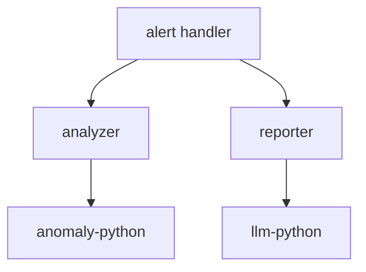

# Detectviz 應用組合（Apps Overview）

本文件說明 detectviz 架構可支持的典型應用組合範例，涵蓋資料處理流程模組、外部模型服務、以及 LLM 整合邏輯。所有模組皆可獨立部署或嵌入式組合使用。

---

## 模組角色概觀

| 模組名稱       | 角色定位           | 說明 |
|----------------|--------------------|------|
| alert          | 流程編排者         | 接收輸入、檢查規則、發送給下游模組並通知 |
| analyzer       | 異常檢測調用器     | 根據 rule 調用對應模型 API，不內建模型邏輯 |
| reporter       | 結果摘要與回報模組 | 呼叫 LLM 分析與報告整合，負責回饋使用者 |
| anomaly-python | 外部異常偵測 API   | 多模型服務，如 IsolationForest、Prophet 等 |
| llm-python     | 外部 LLM API       | 單一接口，處理摘要、回應強化等任務 |

---

## 模組流程範例（異常偵測報告）

1. 使用者發送監控資料進入 `alert` 模組。
2. `alert` 模組比對規則後觸發 `analyzer`。
3. `analyzer` 根據 rule 設定，轉送資料給 `anomaly-python`，取得異常偵測結果。
4. 結果再傳給 `reporter`，由其使用 `llm-python` 生成自然語言摘要或報表。

---

## 應用擴充建議

- 可插入自定義的 `analyzer plugin` 處理不同模型組合（如時間序列、分類）
- `reporter` 可插入 `chat template` 或 `embedding strategy`，適用於不同場景
- 所有外部 API（如 `anomaly-python`, `llm-python`）皆可透過 plugin config 註冊與調用

---

## 多應用整合範例

可將以上模組組成不同應用：

### ✅ 偵測與報告平台

- 使用 `alert + analyzer + reporter` 組合
- 適合部署於多租戶監控平台中

### ✅ CLI 工具流程

- 使用 `cmd/analyze` + `pkg/services/analyzer`
- 單次分析批次資料，用於評估模型或 QA 驗證

### ✅ LLM 摘要轉拋流程

- 使用 `reporter` 作為 webhook 收件者
- 將異常訊息轉換為 LLM 產生報表或推播文字

---

## 實作對應模組

| 模組       | handler 路徑                | service 路徑                | store/plugin |
|------------|-----------------------------|-----------------------------|---------------|
| alert      | `handlers/alert/v1/`        | `services/alert/`           | `store/alertlog/`, notifier |
| analyzer   | `handlers/analyzer/v1/`     | `services/analyzer/`        | plugin/anomaly |
| reporter   | `handlers/reporter/v1/`     | `services/reporter/`        | plugin/llm |
| anomaly    | 外部 API                    |                             | `config/anomaly-api` |
| llm        | 外部 API                    |                             | `config/llm-api` |

---
