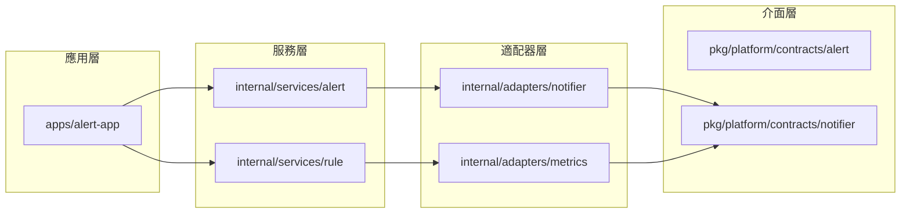

# 開發者導引（Develop Guide）

本文件提供 detectviz 開發者進行模組實作、擴充、測試時的設計參考與作業流程說明，幫助快速理解整體邏輯與模組邊界。

---

## 架構分層與開發原則

detectviz 採用分層架構，依據職責劃分為：

- `apps/`：應用主程式（如 server、cli、testkit）
- `internal/`：業務邏輯與模組實作區
- `pkg/`：共用函式庫、interface、infra
- `docs/`：架構說明與對應介面定義文件

所有模組皆應對應 `docs/interfaces/*.md` 定義規格，並配合 `/todo.md` 規劃實作。

---

## 模組邊界圖（Clean Architecture）

---

## 開發流程建議

1. **閱讀接口設計**
   - 依據 `/docs/interfaces/*.md` 確認模組輸入/輸出、依賴關係
   - 了解相依的 service, store, plugin 使用方式

2. **撰寫模組 scaffold**
   - 每個模組應包含 `.go` 主檔與 `_test.go` 測試
   - 路徑建議依 `/todo.md` 所列方式建立

3. **撰寫對應文件**
   - 模組設計應記錄於 `docs/architecture/*.md`
   - 包含設計目標、資料流、可插拔點與測試建議

4. **依照分層原則設計**
   - handler → service → store → plugin 不可跨層耦合
   - interface 必須抽象於 `pkg/`，實作於 `internal/`

5. **模組測試與 mock**
   - 所有服務模組皆應有 interface 測試與實作測試
   - 可使用 `internal/test/` 中 fake/mock 測資

---

## 命名與版本化建議

- handler 分支版本：`v1/`, `v1beta1/` 路徑區分
- interface 檔案：以業務意圖命名，例如 `AlertNotifier`, `RuleEvaluator`
- plugin 命名：註冊名稱需唯一，例如 `"importers.prometheus"`, `"notifier.slack"`

---

## 插件路徑與分類說明

所有 plugins 依照功能與啟用層級分類為：

- 核心組件：`plugins/core/`（平台啟動即需）
- 社群擴充：`plugins/community/`（依 composition 載入）
  - `importers/`, `exporters/`, `integrations/`
- 開發工具：`plugins/tools/`（僅供除錯開發使用）

---

## 推薦工具與風格

- 格式化工具：`golangci-lint`, `gofumpt`
- 文件生成：支援 mermaid, markdown lint
- 測試框架：`testing`, `testify`, `httptest`
- Interface Style：使用明確動詞（如 `Apply`, `Evaluate`, `Resolve`）
